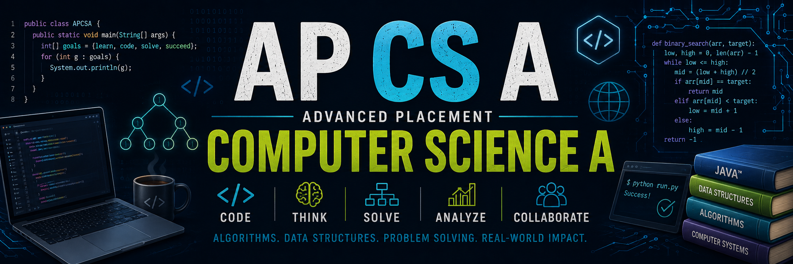

AP Computer Science A is an introduction to Java programming that allows qualified students the possibility of earning university credit for an introductory computer science class. Students will learn logic, syntax, methods, and data structures and develop functional, readable, and reusable computer programs that solve specific problems effectively and efficiently. Students will analyze algorithms and participate in pair-programming activities that facilitate an appreciation for the best programming practices and ethical computing behaviors that underpin computer science. Students who take this college-level course are required to take the AP exam in May.

<table style="width:100%; border:none;">
    <tr valign="top">
        <td width="55%" style="border:none; padding-right:20px;">
            <h2>Quick Links</h2>
            <table style="width:100%; border-collapse:separate; border-spacing:10px 10px;">
                <tr>
                    <td align="center" style="background-color:#f2f2f2; border-radius:8px; padding:0; width:50%;">
                        <a href="https://hunschool.instructure.com/courses/6608/modules" target="_parent" style="display:block; text-align:center; padding:12px; text-decoration:none; font-weight:bold; color:#2D3B45;">🧩 Modules</a>
                    </td>
                    <td align="center" style="background-color:#f2f2f2; border-radius:8px; padding:0; width:50%;">
                        <a href="https://hunschool.instructure.com/courses/6608/grades" target="_parent" style="display:block; text-align:center; padding:12px; text-decoration:none; font-weight:bold; color:#2D3B45;">✅ Grades</a>
                    </td>
                </tr>
                <tr>
                    <td align="center" style="background-color:#f2f2f2; border-radius:8px; padding:0;">
                        <a href="https://hunschool.instructure.com/courses/6608/assignments/syllabus" target="_parent" style="display:block; text-align:center; padding:12px; text-decoration:none; font-weight:bold; color:#2D3B45;">📖 Syllabus</a>
                    </td>
                    <td align="center" style="background-color:#f2f2f2; border-radius:8px; padding:0;">
                        <a href="https://hunschool.instructure.com/courses/6608/announcements" target="_parent" style="display:block; text-align:center; padding:12px; text-decoration:none; font-weight:bold; color:#2D3B45;">📣 Announcements</a>
                    </td>
                </tr>
            </table>
        </td>
        <td width="45%" style="border:none;">
            <h2>Instructor Info</h2>
            
            
Paul Baier

            
📧 <a href="mailto:paulbaier@hunschool.org">paulbaier@hunschool.org</a>

            
📞 (609) 580-1038 ext. 3412

        </td>
    </tr>
</table>