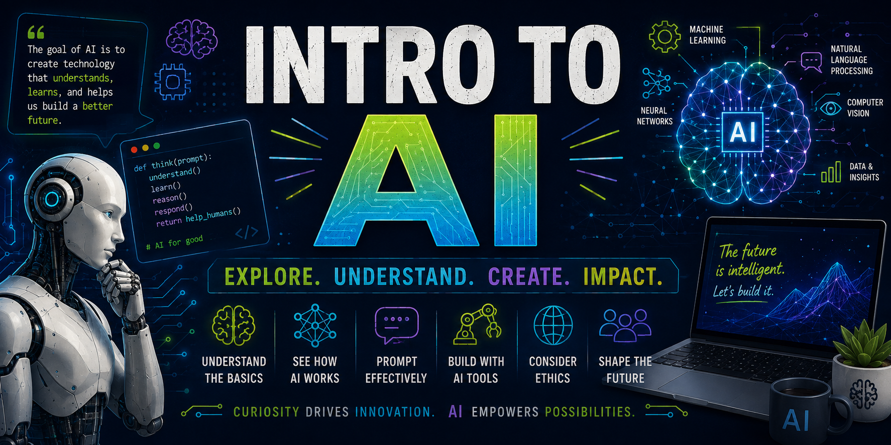

Introduction to Artificial Intelligence is a trimester course in which students will discover what artificial intelligence (AI) is, how it is currently used, and how it could be used in the future. They will be introduced to machine learning, deep learning, and neural networks and how they already make decisions in daily life. Students will be taught the history of AI, how it is used today, and delve into the future of AI and its many possible applications while exploring issues and concerns surrounding AI. Students will experiment with numerous AI applications, and do some basic programming of an artificially intelligent system.

<table style="width:100%; border:none;">
    <tr valign="top">
        <td width="55%" style="border:none; padding-right:20px;">
            <h2>Quick Links</h2>
            <table style="width:100%; border-collapse:separate; border-spacing:10px 10px;">
                <tr>
                    <td align="center" style="background-color:#f2f2f2; border-radius:8px; padding:0; width:50%;">
                        <a href="https://hunschool.instructure.com/courses/6507/modules" target="_parent" style="display:block; text-align:center; padding:12px; text-decoration:none; font-weight:bold; color:#2D3B45;">🧩 Modules</a>
                    </td>
                    <td align="center" style="background-color:#f2f2f2; border-radius:8px; padding:0; width:50%;">
                        <a href="https://hunschool.instructure.com/courses/6507/grades" target="_parent" style="display:block; text-align:center; padding:12px; text-decoration:none; font-weight:bold; color:#2D3B45;">✅ Grades</a>
                    </td>
                </tr>
                <tr>
                    <td align="center" style="background-color:#f2f2f2; border-radius:8px; padding:0;">
                        <a href="https://hunschool.instructure.com/courses/6507/assignments/syllabus" target="_parent" style="display:block; text-align:center; padding:12px; text-decoration:none; font-weight:bold; color:#2D3B45;">📖 Syllabus</a>
                    </td>
                    <td align="center" style="background-color:#f2f2f2; border-radius:8px; padding:0;">
                        <a href="https://hunschool.instructure.com/courses/6507/announcements" target="_parent" style="display:block; text-align:center; padding:12px; text-decoration:none; font-weight:bold; color:#2D3B45;">📣 Announcements</a>
                    </td>
                </tr>
            </table>
        </td>
        <td width="45%" style="border:none;">
            <h2>Instructor Info</h2>
            
            
Paul Baier

            
📧 <a href="mailto:paulbaier@hunschool.org">paulbaier@hunschool.org</a>

            
📞 (609) 580-1038 ext. 3412

        </td>
    </tr>
</table>