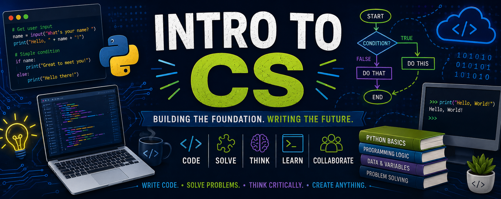

How does one go from being a consumer of technology to a creator of it? Intro to CS is a trimester course that will explore that question.  Students will learn to think critically and systematically while designing programs and writing code. We will look deeper into what it means to practice good digital citizenship and safety online.  We will seek to better understand the technology we use on a daily basis, its inherent biases, and the impact it has on our lives and interactions with the world around us.

<table style="width:100%; border:none;">
    <tr valign="top">
        <td width="55%" style="border:none; padding-right:20px;">
            <h2>Quick Links</h2>
            <table style="width:100%; border-collapse:separate; border-spacing:10px 10px;">
                <tr>
                    <td align="center" style="background-color:#f2f2f2; border-radius:8px; padding:0; width:50%;">
                        <a href="https://hunschool.instructure.com/courses/6487/modules" target="_parent" style="display:block; text-align:center; padding:12px; text-decoration:none; font-weight:bold; color:#2D3B45;">🧩 Modules</a>
                    </td>
                    <td align="center" style="background-color:#f2f2f2; border-radius:8px; padding:0; width:50%;">
                        <a href="https://hunschool.instructure.com/courses/6487/grades" target="_parent" style="display:block; text-align:center; padding:12px; text-decoration:none; font-weight:bold; color:#2D3B45;">✅ Grades</a>
                    </td>
                </tr>
                <tr>
                    <td align="center" style="background-color:#f2f2f2; border-radius:8px; padding:0;">
                        <a href="https://hunschool.instructure.com/courses/6487/assignments/syllabus" target="_parent" style="display:block; text-align:center; padding:12px; text-decoration:none; font-weight:bold; color:#2D3B45;">📖 Syllabus</a>
                    </td>
                    <td align="center" style="background-color:#f2f2f2; border-radius:8px; padding:0;">
                        <a href="https://hunschool.instructure.com/courses/6487/announcements" target="_parent" style="display:block; text-align:center; padding:12px; text-decoration:none; font-weight:bold; color:#2D3B45;">📣 Announcements</a>
                    </td>
                </tr>
            </table>
        </td>
        <td width="45%" style="border:none;">
            <h2>Instructor Info</h2>
            
            
Paul Baier

            
📧 <a href="mailto:paulbaier@hunschool.org">paulbaier@hunschool.org</a>

            
📞 (609) 580-1038 ext. 3412

        </td>
    </tr>
</table>