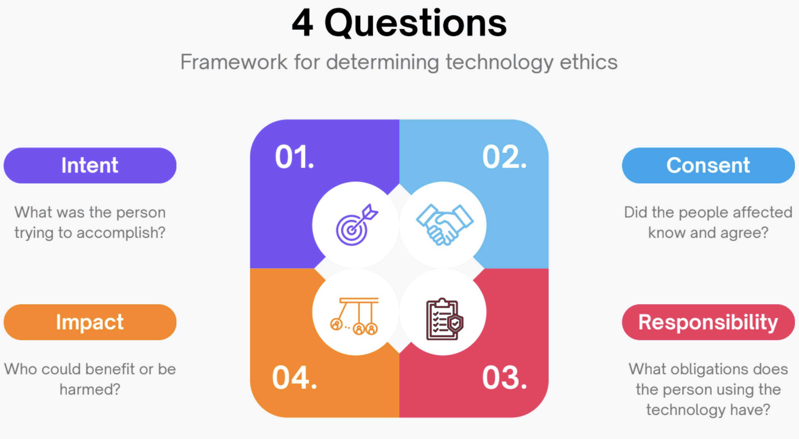

<html lang="en">
<head>
<meta charset="UTF-8">
<meta name="viewport" content="width=device-width, initial-scale=1.0">
<title>Top 10 Rules for Responsible Technology Use</title>

</head>

<body>

    <h1>Top 10 Rules for Responsible Technology Use</h1>
    
Think before you click, code, or act.

    

        
10

        
Be kind, respectful, and responsible when using technology.

    

    

        
9

        
Think about how your code or actions affect people.

    

    

        
8

        
Give credit where it’s due.

    

    

        
7

        
Don’t use others’ devices or accounts without asking.

    

    

        
6

        
Only use software, hardware, and resources you are permitted to use.

    

    

        
5

        
Be honest online.

    

    

        
4

        
Don’t steal or cheat with computers.

    

    

        
3

        
Ask before you look at someone’s files.

    

    

        
2

        
Don’t mess with someone else’s work.

    

    

        
1

        
Don’t use technology to hurt others.

    

    

        Responsible technology use starts with you.
    

    <h1>Four Questions of Computer Ethics</h1>
    

</body>
</html>