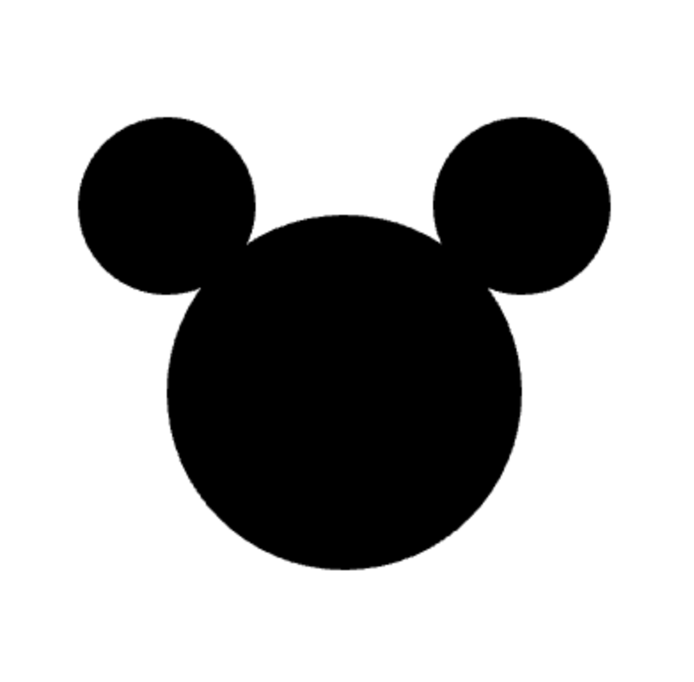
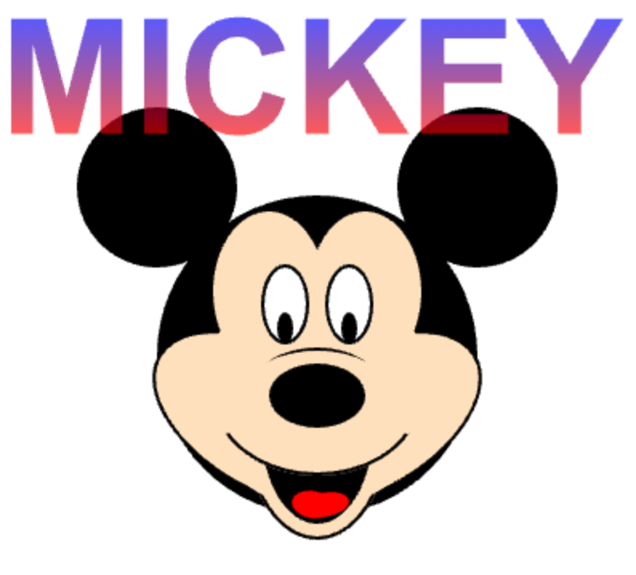

# Unit 1: Drawing with Shapes, Colors, and Labels  
### CREATIVE TASK

In this Creative Task, you will create an illustration using shapes, colors, and labels. You will use different properties with your shapes including gradients and opacity.

---

## 📝 Project Requirements

You will use different shapes to create a complex shape. The shapes must be combined and layered in such a way to create a new object that is irregularly shaped.

Your drawing must include, **at minimum**:

- 3 different types of shapes (not including the label):  
  circles, stars, rectangles, ovals, and lines  
- 1 label  
- 1 gradient property  
- 1 opacity property  
- Comments, groupings, and line breaks to organize your code  

Your implementation of the requirements must be coherent, relevant, meaningful, and add to the image. For example, changing a shape's opacity to 99 just to fulfill the requirement will **not** count as fulfilling the requirement.

---

### ⚠️ Examples

**Simple Mickey (Does NOT meet project requirements)**  

**Complex Mickey (Meets requirements)**  

---

## 🧰 Resources

<ul>
  <li><a href="https://academy.cs.cmu.edu/docs#colors" target="_blank" rel="noopener noreferrer">Color Chart</a></li>
  <li><a href="https://academy.cs.cmu.edu/docs#rgbValues" target="_blank" rel="noopener noreferrer">How to Use RGB in CS Academy</a></li>
  <li><a href="https://www.google.com/search?q=rgb+color+picker" target="_blank" rel="noopener noreferrer">RGB Color Picker</a></li>
  <li><a href="https://academy.cs.cmu.edu/docs#rgbAndGradients" target="_blank" rel="noopener noreferrer">Gradient Examples</a></li>
</ul>

**Shape Documentation:**

<ul>
  <li><a href="https://academy.cs.cmu.edu/docs#circle" target="_blank" rel="noopener noreferrer">Circles</a></li>
  <li><a href="https://academy.cs.cmu.edu/docs#star" target="_blank" rel="noopener noreferrer">Stars</a></li>
  <li><a href="https://academy.cs.cmu.edu/docs#rect" target="_blank" rel="noopener noreferrer">Rectangles</a></li>
  <li><a href="https://academy.cs.cmu.edu/docs#oval" target="_blank" rel="noopener noreferrer">Ovals</a></li>
  <li><a href="https://academy.cs.cmu.edu/docs#line" target="_blank" rel="noopener noreferrer">Lines</a></li>
  <li><a href="https://academy.cs.cmu.edu/docs#label" target="_blank" rel="noopener noreferrer">Labels</a></li>
</ul>
 

---

## ✅ Submission Requirements

1. Write your code in **CS Academy 1.6 Creative Task 1**.  
   You can use CT2 and the sandbox area as practice if needed.  
   Be sure to submit your code on CS Academy when complete.  

   > **Important:** Once you submit the code, it will be locked until it is graded.  
   > You will not be able to edit code after submission, so do not submit until you are ready.

2. Submit your **CT Reflection on Canvas**.  

   - If you're on a tablet, click the red button below to open the external tool.  
   - If you're in a web browser, you will see a button below these instructions.  
   - Click that button to open the Google Doc.  
   - When finished, return and click **Submit**.
