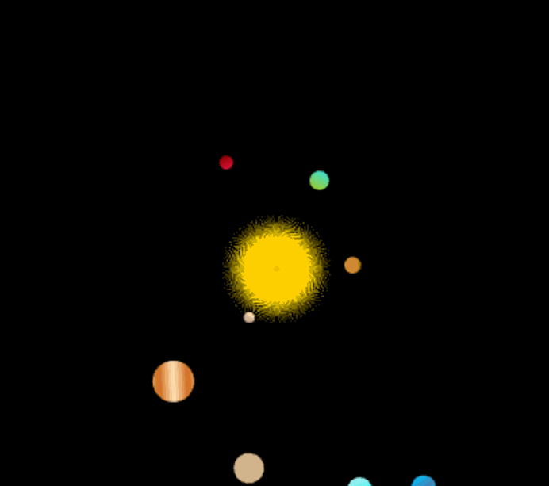
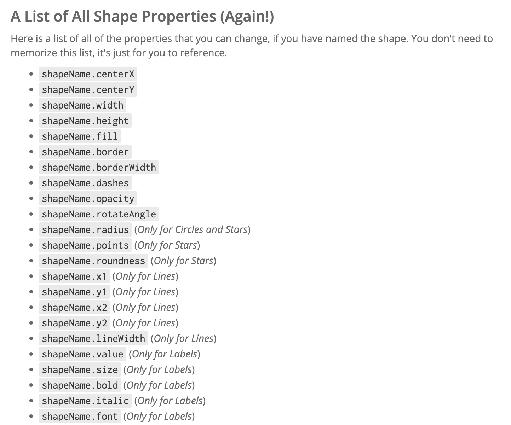

# **Unit 2: Basic Animations**

### *Collaborative Task*

In this Collaborative Task, you will work with a partner to create an animation. You will design shapes and animate those shapes using events.

---

## 📋 Project Requirements

Work in pairs to create an animation. You can use mouse events and the `onStep` event handler to move your objects.

Your project must include, **at minimum**:

* A **complex** object composed of several types of shapes (circles, stars, rectangles, ovals, and/or lines)
* **3 properties changed using an event handler** (e.g., `rotateAngle`, `centerX`, `centerY`, `x2`, `y2`, `radius`, etc.)

  * You must change **different properties** to meet this requirement
  * Example: changing only `rotateAngle` on three objects will count as one property changed
* 1 variable
* 2 event handlers (`onMousePress`, `onMouseMove`, `onMouseRelease`, `onMouseDrag`, `onStep`)
* Comments to organize your code

### ⚠️ Key Requirements

A significant number of points will be deducted if you do not meet these:

* You and your partner must do **equal amounts of work**
* You may **only use the event handlers listed above**
* You may **not use concepts not yet covered** (e.g., conditionals, custom functions, etc.)

---

### 🎬 Example Animation

  

---

## 🧰 Resources

<ul>
  <li><a href="https://academy.cs.cmu.edu/docs#colors" target="_blank" rel="noopener noreferrer">Color Chart</a></li>
  <li><a href="https://academy.cs.cmu.edu/docs#rgbAndGradients" target="_blank" rel="noopener noreferrer">Gradient Examples</a></li>
</ul>

<strong>Shape Documentation:</strong>

<ul>
  <li><a href="https://academy.cs.cmu.edu/docs#circle" target="_blank" rel="noopener noreferrer">Circles</a></li>
  <li><a href="https://academy.cs.cmu.edu/docs#star" target="_blank" rel="noopener noreferrer">Stars</a></li>
  <li><a href="https://academy.cs.cmu.edu/docs#rect" target="_blank" rel="noopener noreferrer">Rectangles</a></li>
  <li><a href="https://academy.cs.cmu.edu/docs#oval" target="_blank" rel="noopener noreferrer">Ovals</a></li>
  <li><a href="https://academy.cs.cmu.edu/docs#line" target="_blank" rel="noopener noreferrer">Lines</a></li>
  <li><a href="https://academy.cs.cmu.edu/docs#label" target="_blank" rel="noopener noreferrer">Labels</a></li>
  <li><a href="https://academy.cs.cmu.edu/docs#generalShapeProperties" target="_blank" rel="noopener noreferrer">General Shape Properties</a></li>
</ul>

<strong>Mouse Functions Documentation:</strong>

<ul>
  <li><a href="https://academy.cs.cmu.edu/docs#onMousePress" target="_blank" rel="noopener noreferrer">onMousePress</a></li>
  <li><a href="https://academy.cs.cmu.edu/docs#onMouseMove" target="_blank" rel="noopener noreferrer">onMouseMove</a></li>
  <li><a href="https://academy.cs.cmu.edu/docs#onMouseRelease" target="_blank" rel="noopener noreferrer">onMouseRelease</a></li>
  <li><a href="https://academy.cs.cmu.edu/docs#onMouseDrag" target="_blank" rel="noopener noreferrer">onMouseDrag</a></li>
</ul>

---

  

---

## ✅ Submission Requirements

1. Write your code in **CS Academy 2.5 Collaborative Task**

   * Submit your code on CS Academy when complete
   * ⚠️ Once submitted, your code will be **locked** and cannot be edited

2. Submit your **CT Reflection on Canvas**

   * Each partner must submit their **own reflection**
