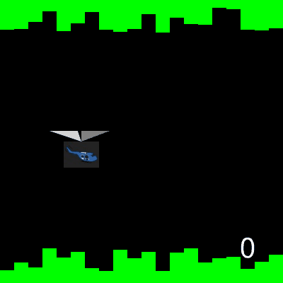

# 🎮 **Unit 3 – Giving Programs Options & Animating Lots of Shapes**

### *Creative Task*

**In this Creative Task, you will create a game combining animation with user interaction.**

---

## 📝 **Project Requirements**

For this cumulative project, you will design a game using concepts learned in Units 1–3. Your project must include, **at minimum**:

* 1 keyboard or mouse event
* 1 `onStep` event
* 1 conditional (`if` statement)
* 1 shape method – `hits()` or `hitsShape()`
* 1 group
* 1 complex image (several shapes combined to create a new object)
* A game setting (background + additional shapes to create a "game world")
* Game "characters" (can count as the complex image if needed)
* On-screen gameplay instructions (**not comments in code**)
* A clear game objective (win/lose condition) and indication of that goal
* Comments, line breaks, and grouping to organize your code
* ❌ Do **not** use concepts we haven’t covered yet (e.g., custom functions, `while` loops, `AND`, `OR`, etc.)

---

  

---

## 🧰 **Resources**

* <a href="https://academy.cs.cmu.edu/docs#colors" target="_blank">Color Chart</a>
* <a href="https://academy.cs.cmu.edu/docs#rgbAndGradients" target="_blank">Gradient Examples</a>

**Shape Documentation:**

* <a href="https://academy.cs.cmu.edu/docs#circle" target="_blank">Circles</a>

* <a href="https://academy.cs.cmu.edu/docs#star" target="_blank">Stars</a>

* <a href="https://academy.cs.cmu.edu/docs#rect" target="_blank">Rectangles</a>

* <a href="https://academy.cs.cmu.edu/docs#oval" target="_blank">Ovals</a>

* <a href="https://academy.cs.cmu.edu/docs#line" target="_blank">Lines</a>

* <a href="https://academy.cs.cmu.edu/docs#label" target="_blank">Labels</a>

* <a href="https://academy.cs.cmu.edu/docs#generalShapeProperties" target="_blank">General Shape Properties</a>

**Mouse & Keyboard Events:**

* <a href="https://academy.cs.cmu.edu/docs#onMousePress" target="_blank">onMousePress</a>
* <a href="https://academy.cs.cmu.edu/docs#onMouseMove" target="_blank">onMouseMove</a>
* <a href="https://academy.cs.cmu.edu/docs#onMouseRelease" target="_blank">onMouseRelease</a>
* <a href="https://academy.cs.cmu.edu/docs#onMouseDrag" target="_blank">onMouseDrag</a>
* <a href="https://academy.cs.cmu.edu/docs#onKeyPress" target="_blank">onKeyPress</a>
* <a href="https://academy.cs.cmu.edu/docs#onKeyRelease" target="_blank">onKeyRelease</a>
* <a href="https://academy.cs.cmu.edu/docs#onKeyHold" target="_blank">onKeyHold</a>

**Shape Methods:**

* <a href="https://academy.cs.cmu.edu/docs#generalShapeMethods" target="_blank">General Shape Methods</a>
  *(toFront, toBack, contains, containsShape, hits, hitsShape)*

---

## ✅ **Submission Requirements**

1. Write your code in **CS Academy 3.6 Creative Task #1**

   * Be sure to submit your code on CS Academy when complete
   * ⚠️ Once submitted, your code will be **locked** until graded

2. Submit your **CT Reflection on Canvas**

---
